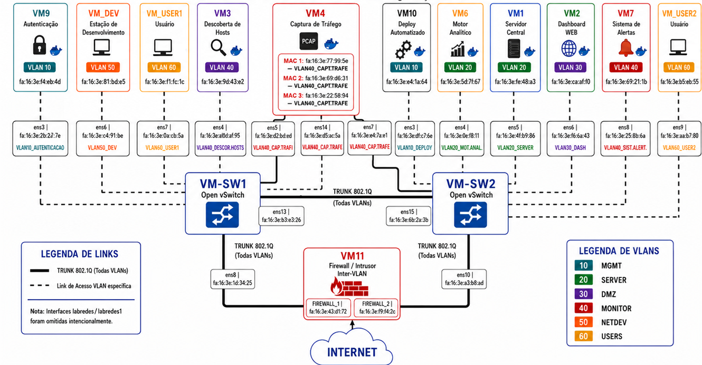
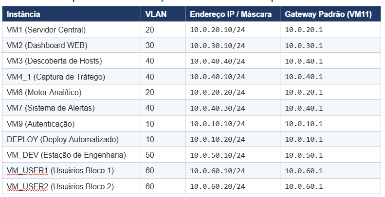
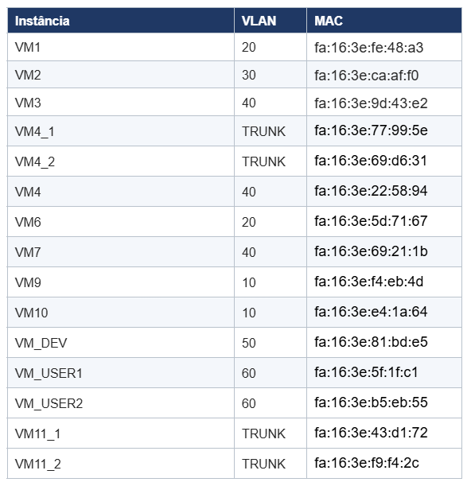

# LabRedes — Aluno 5 — Open vSwitch, VLANs e Observabilidade

Este repositório reúne os arquivos de configuração utilizados no módulo de infraestrutura de Camada 2 do trabalho de Laboratório de Redes.

O objetivo deste módulo foi implementar a comutação virtual da topologia utilizando **Open vSwitch**, segmentação por **VLANs**, enlaces **trunk 802.1Q**, portas **access**, integração com o firewall/roteador inter-VLAN `VM11` e espelhamento de tráfego para a `VM4` por meio de regras **SPAN/OpenFlow**.

A organização do repositório foi feita de forma simples, separando os arquivos por máquina virtual configurada:

* `VM_SW1`: arquivos de configuração do Switch Virtual 1;
* `VM_SW2`: arquivos de configuração do Switch Virtual 2;
* `VM4_Captura`: arquivos de preparação da VM4 para recepção e separação do tráfego espelhado;
* `docs`: imagens e materiais de apoio utilizados para documentação da topologia.

---

## Visão geral da topologia

A imagem abaixo apresenta a topologia consolidada da infraestrutura, com a distribuição das máquinas virtuais, VLANs, enlaces access, trunks entre switches, integração com o firewall/roteador `VM11` e pontos de captura de tráfego na `VM4`.



---

## Plano de endereçamento IP

A tabela abaixo apresenta os endereços IP utilizados nas principais instâncias da infraestrutura, organizados por VLAN e gateway padrão.



---

## Mapeamento de endereços MAC

A tabela abaixo apresenta os endereços MAC associados às máquinas virtuais e interfaces relevantes da infraestrutura.



---

## Mapeamento das interfaces dos switches

Cada switch virtual possui um conjunto específico de interfaces Linux associadas às redes criadas no OpenStack. As imagens abaixo documentam o vínculo entre interface, endereço MAC e rede correspondente.

### VM_SW1


### VM_SW2


---

## Estrutura do repositório

```text
labredes-aluno5-ovs/
├── README.md
├── docs/
│   ├── Topologia.png
│   ├── IPs.png
│   ├── MACs.png
│   ├── VM_SW1-interfaces.png
│   └── VM_SW2-interfaces.png
│
├── VM_SW1/
│   ├── README.md
│   ├── netplan/
│   │   └── 99-cloud-init.yaml
│   └── ovs/
│       ├── 01-criar-bridge.sh
│       ├── 02-configurar-trunks.sh
│       ├── 03-configurar-portas-access.sh
│       └── 04-span-openflow.sh
│
├── VM_SW2/
│   ├── README.md
│   ├── netplan/
│   │   └── 99-cloud-init.yaml
│   └── ovs/
│       ├── 01-criar-bridge.sh
│       ├── 02-configurar-trunks.sh
│       ├── 03-configurar-portas-access.sh
│       └── 04-span-openflow.sh
│
└── VM4_Captura/
    ├── README.md
    └── configurar-captura-vlans.sh
```

---

## Descrição das pastas

### `docs/`

Contém os arquivos visuais utilizados para documentação do projeto.

Nesta pasta estão armazenados:

* `Topologia.png`: diagrama geral da topologia física-virtual;
* `IPs.png`: tabela com endereços IP, VLANs e gateways das máquinas;
* `MACs.png`: tabela com os endereços MAC das instâncias;
* `VM_SW1-interfaces.png`: mapeamento das interfaces do Switch Virtual 1;
* `VM_SW2-interfaces.png`: mapeamento das interfaces do Switch Virtual 2.

Esses arquivos servem como referência visual para entender a relação entre as máquinas virtuais, as VLANs, os enlaces de acesso, os trunks e as interfaces de captura.

---

### `VM_SW1/`

Contém os arquivos referentes à configuração do `VM_SW1`.

O `VM_SW1` é um dos switches virtuais da topologia e concentra parte das portas de acesso, o enlace trunk com o `VM_SW2`, o enlace trunk com o firewall/roteador `VM11` e uma das saídas de espelhamento para a `VM4`.

Dentro da pasta há um `README.md` próprio explicando cada arquivo e o passo a passo de execução.

---

### `VM_SW2/`

Contém os arquivos referentes à configuração do `VM_SW2`.

O `VM_SW2` é o segundo switch virtual da topologia. Ele conecta outras máquinas da infraestrutura, possui enlace trunk com o `VM_SW1`, enlace com o firewall/roteador `VM11` e uma segunda saída de espelhamento para a `VM4`.

Dentro da pasta há um `README.md` próprio explicando cada arquivo e o passo a passo de execução.

---

### `VM4_Captura/`

Contém o script de configuração da `VM4`, responsável pela recepção do tráfego espelhado.

A `VM4` atua como ponto de observabilidade da infraestrutura, recebendo tráfego clonado dos switches virtuais e separando esse tráfego por subinterfaces VLAN para análise com ferramentas como `tcpdump`.

Dentro da pasta há um `README.md` próprio explicando o funcionamento do script e os exemplos de captura.

---

## Fluxo geral de configuração

A configuração geral da infraestrutura segue a seguinte lógica:

1. Configuração das interfaces de gerência dos switches com Netplan;
2. Criação da bridge `br-int` em cada switch virtual;
3. Configuração dos enlaces trunk;
4. Configuração das portas access;
5. Aplicação das regras de espelhamento SPAN/OpenFlow;
6. Preparação da `VM4` para receber e separar o tráfego espelhado;
7. Validação da topologia com comandos de auditoria e testes de conectividade.

Os comandos detalhados de execução estão descritos nos READMEs das respectivas pastas:

* [`VM_SW1/README.md`](VM_SW1/README.md)
* [`VM_SW2/README.md`](VM_SW2/README.md)
* [`VM4_Captura/README.md`](VM4_Captura/README.md)

---

## Tecnologias utilizadas

* Linux Ubuntu 24.04 LTS;
* OpenStack;
* Open vSwitch;
* VLAN 802.1Q;
* OpenFlow;
* Netplan;
* tcpdump;
* Bash.

---

## Observações importantes

As interfaces de gerência vinculadas à rede `labredes1` não devem ser adicionadas à bridge `br-int`, pois são responsáveis pelo acesso administrativo às instâncias via SSH.

No `VM_SW1`, a interface de gerência é a `ens9`.

No `VM_SW2`, a interface de gerência é a `ens11`.

A adição dessas interfaces à bridge de produção poderia causar perda de conectividade administrativa com as máquinas virtuais.

---

## Comandos gerais de validação

Após a execução dos scripts, alguns comandos úteis para verificar a configuração são:

```bash
sudo ovs-vsctl show
```

```bash
sudo ovs-ofctl dump-flows br-int
```

```bash
sudo ovs-vsctl list Port
```

```bash
ip -s link show
```

Na VM4, as capturas podem ser realizadas com comandos como:

```bash
sudo tcpdump -i ens3.50 -e -n
```

```bash
sudo tcpdump -i ens7.60 -e -n
```

---

## Finalidade do repositório

Este repositório não tem como objetivo substituir o relatório técnico do trabalho, mas sim organizar os arquivos de configuração utilizados na implementação prática.

Ele funciona como um complemento técnico ao relatório, permitindo consultar rapidamente os scripts aplicados em cada máquina virtual e compreender a organização geral da infraestrutura implementada.
